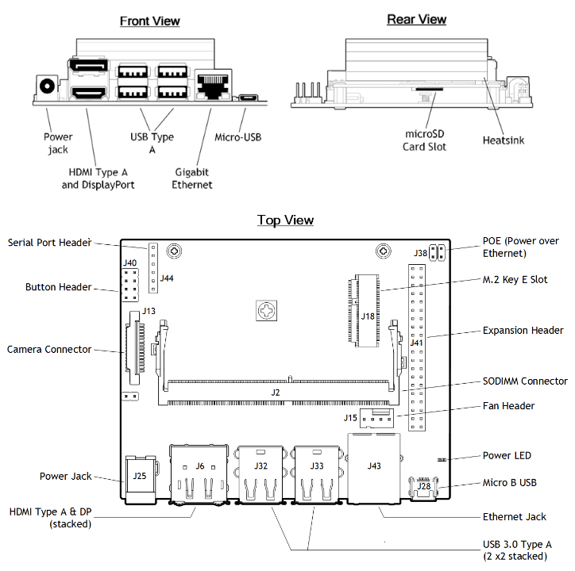

This repository provides an overview of the NVIDIA Jetson Nano, demonstrating how to set it up for real-time object detection using deep learning models and how to utilize its GPIO interface for controlling external devices.

## What is NVIDIA® Jetson Nano™?
This is the description you can find on NVIDIA’s official website to explain the Jetson Nano:

> "The NVIDIA® Jetson Nano™ Developer Kit delivers the compute performance to run modern AI workloads at unprecedented size, power, and cost. Developers, learners, and makers can now run AI frameworks and models for applications like image classification, object detection, segmentation, and speech processing.  
>
> The developer kit can be powered by micro-USB and comes with extensive I/Os, ranging from GPIO to CSI. This makes it simple for developers to connect a diverse set of new sensors to enable a variety of AI applications. It’s incredibly power-efficient, consuming as little as 5 watts.  
>
> Jetson Nano is also supported by NVIDIA JetPack™, which includes a board support package (BSP), Linux OS, NVIDIA CUDA®, cuDNN, and TensorRT™ software libraries for deep learning, computer vision, GPU computing, multimedia processing, and much more. The software is even available using an easy-to-flash SD card image, making it fast and easy to get started.  
>
> The same JetPack SDK is used across the entire NVIDIA Jetson™ family of products and is fully compatible with NVIDIA’s world-leading AI platform for training and deploying AI software. This proven software stack reduces complexity and overall effort for developers."

**Key Features**

**Jetson Nano Module**
- 128-Core NVIDIA Maxwell™ GPU 
- Quad-Core ARM® A57 CPU  
- 4 GB 64-Bit LPDDR4 memory  
- 10/100/1000BASE-T Ethernet  

**Power Options** 
- Micro-USB (5V 2A) 
- DC Power Adapter (5V 4A)  

**I/O**
- USB 3.0 Type-A
- USB 2.0 Micro-B cable
- HDMI / DisplayPort output  
- M.2 Key E slot  
- Gigabit Ethernet  
- GPIOs, I2C, I2S, SPI, UART interfaces  
- MIPI-CSI Camera Connector  
- Fan Connector
- PoE Connector 

**Kit Contents**
- NVIDIA Jetson Nano Module with heatsink and reference carrier board  
- Quick Start Guide and Support Guide  
  

  

In short, the NVIDIA Jetson Nano is a compact yet powerful platform designed for AI, computer vision, and robotics applications.
It provides the performance needed to run modern deep learning models while remaining affordable, energy-efficient, and easy to use.
With support for JetPack SDK, versatile I/O ports, and strong GPU acceleration, the Jetson Nano is an excellent choice for building real-time AI systems at the edge.

## Why NVIDIA® Jetson Nano™?
The Jetson Nano is widely used in robotics and computer vision because it can run AI models locally in real time without needing a powerful desktop or cloud connection. Its GPU makes it ideal for tasks like object detection, image recognition, and sensor data processing, while its GPIO pins let it easily connect to motors, cameras, and sensors — making it a perfect choice for smart robots and AI-powered vision systems.  

**Now that we understand what the NVIDIA® Jetson Nano is and why it’s popular, let’s dive into setting it up and getting hands-on with it!**
